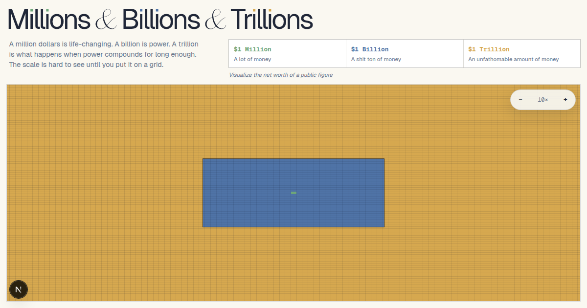

# Millions & Billions & Trillions

An interactive visualization that compares the differences in scale between one million, one billion, and one trillion dollars.. The app centers the comparison on a zoomable grid, then lets visitors look up a public figure's estimated net worth and see that amount placed in context.



## Features

- Zoomable SVG grid comparing **$1 million**, **$1 billion**, and **$1 trillion** at true relative scale.
- Scroll, double-click, keyboard, and button zoom controls with animated scale-key shortcuts.
- Public-figure net-worth lookup with cited sources and an outlined box showing the result on the grid.
- Daily request limiting plus cached lookup results to keep repeated searches fast and inexpensive.
- Custom typography, responsive layout, and built-in Open Graph / Twitter preview images.

## Technical notes / architecture

- Built with **Next.js App Router**, **React**, **TypeScript**, CSS Modules, and local fonts.
- The interactive shell is split across `WealthExperience`, `HeroHeader`, and `ZoomableGrid`: the header owns the lookup UI, while the grid renders scale geometry and zoom behavior in the browser.
- `app/api/net-worth/route.ts` validates requests with Zod, uses the Vercel AI SDK with OpenAI web search for structured net-worth results, normalizes sources, and returns a compact JSON response.
- **Turso/libSQL + Drizzle ORM** store 30-day net-worth cache entries, alias lookup keys, and per-IP daily rate-limit counters.
- Cache writes happen asynchronously with `after()` so successful lookups can return without waiting for persistence.

## Local development

```bash
pnpm install
pnpm dev
```

Required environment variables:

```bash
OPENAI_API_KEY=
TURSO_DATABASE_URL=
TURSO_AUTH_TOKEN=
```
